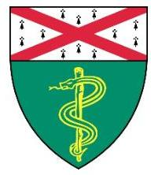
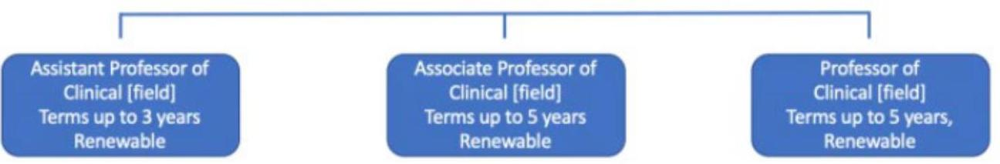

Yale Department of Radiology and Biomedical Imaging (YDR)

Faculty Development Program and Guidelines

---

Topic
Introduction ..... 3
Section 1: OVERVIEW OF FACULTY TRACKS, RANKS \& POSITIONS ..... 4
Section 2: APPOINTMENTS AND PROMOTIONS (A\&P) PROCESS ..... 6
A. Promotions Advisory Committee
B. Appointments \& Promotion Committee
C. Materials for Appointments \& Promotions
D. Dept Appointments \& Promotions Review
E. Yale School of Medicine Appointments \& Promotions Review
F. Contact information - YDR
Section 3: CLINICAL RADIOLOGY DIVISION ..... 11
A. Requirements for Appointments \& Promotions
B. Transfer between tracks
C. Clinical Track
D. Clinician Educator Track
E. Clinician Scientist Track
Section 4: FEEDBACK TO FACULTY A\&P PROGRESS ..... 19
A. Annual Survey for Faculty Career Development
B. Mentor feedback
C. Promotions Advisory Committee Review
Section 5: YDR MENTORING PROGRAMS ..... 20
A. Orientation \& Dissemination - Intranet
B. Faculty Promotion Advisor
C. Academic/Section Mentor
D. Programs for Faculty Development
Section 6: BIOIMAGING SCIENCES DIVISION ..... 22
Addendum 1: Standards of Professional Behavior (Yale New Haven Health) ..... 23
Addendum 2: Associate Professor Referee Evaluation form ..... 24
Addendum 3: Referee Letter Requirements ..... 28
Addendum 4: Letters of Evaluation from Arms vs Non-Arms Length Referees ..... 29
Addendum 5: YSM Ladder Faculty Metrics ..... 30

---

The Department of Radiology \& Biomedical Imaging (YDR) has a strong commitment to the advancement of our faculty. The faculty at the School of Medicine together are responsible for advancing the clinical, educational, and research missions of the School. This document provides an outline of YDR's program for faculty development and mentorship.

# ABBREVIATIONS 

A\&P: Appointment and Promotions
PAC: Promotions Advisory Committee
OAPD: YSM Office of Academic and Professional Development

YDR: Yale Department of Radiology and Biomedical Imaging
BIS: Bioimaging Sciences Division of YDR
YSM: Yale School of Medicine
YNHHS: Yale New Haven Health System (Hospital system extending from RI to Southern CT)

C: Clinical Track
CE: Clinician Educator track
CS: Clinician Scientist track
ARS: Associate Research Scientist
RS: Research Scientist
SRS: Senior Research Scientist

CV1: Yale formatted Curriculum Vitae, Part 1 (typical CV)
CV2: Yale formatted Curriculum Vitae, Part 2 (descriptive CV)
LOR: Letter of reference/referee letter
IPF: Individual productivity form

---

# SECTION 1: OVERVIEW OF FACULTY TRACKS, RANKS \& POSITIONS 

The faculty tracks and ranks recognize the different levels of experience, expertise, and accomplishments in each of these domains. The below provides an overview of the tracks and ranks. For more specific information, please consult the Yale University Faculty Handbook.

## A. Ladder Ranks:

a. Assistant Professor
b. Associate Professor
c. Associate Professor with Tenure (Traditional Track only)
d. Professor

## B. Ladder Tracks:

- Clinical Track:
- Emphasizes excellence in patient care, education when trainees are available and research as a possibility
- $>90 \%$ clinical, which may include administrative time
- Clinician-Educator (CE):
- Emphasizes excellence in patient care, education and research scholarship
- Clinical and Academic Scholarship, up to 80\% clinical
- Clinician-Scientist (CS):
- Emphasizes research scholarship with additional focuses on clinical care and education
- >=50\% FTE devoted to or funded by research
- Investigator Track:
- Emphasizes excellence in individual and team science
- Solely research
- Traditional Track:
- Emphasizes driving new areas of research as well as being outstanding educators, and if engaged in patient care, exemplary clinical skills
- Must reach tenure by year 10
- Combination of research and teaching

---

# C. Non-Ladder Tracks: 

- Research Ranks
- Associate Research Scientist (ARS)
- Individuals who are engaged in scholarly research in association with a faculty member or as a member of a research group
- Research Scientist (RS)
- Individuals who are engaged in scholarly or scientific research as advanced scholars or as senior members of a research group
- Senior Research Scientist (SRS)
- Individuals of high professional attainment, outstanding ability, and critical importance to a major research program
- Instructor of Clinical Radiology and Biomedical Imaging
- Individuals with a MD or other terminal clinical degree who have completed training and who are employed by Yale to provide clinical services
- Appointments are 1 year in duration and are renewable
- Voluntary Ranks
- Typically, clinicians or others who are employed outside of the School and make significant contributions to department programs as teachers and role models for trainees
- Ranks are commensurate with experience: Clinical Instructor, Assistant Clinical Professor, Associate Clinical Professor and Clinical Professor

---

# SECTION 2: APPOINTMENTS AND PROMOTIONS (A\&P) PROCESS 

Appointment (including reappointment) or promotion is a lengthy process, which usually requires an entire academic year to complete. Please refer to timeline of steps below. The process may change for (i) initial appointment at a rank, (ii) reappointment, (iii) reappointment for a $2^{\text {nd }}$ term, and (iv) promotion.

| Feb-April: | Update your materials |
| :--: | :--: |
| May 1: | Submission of CV1, CV2, and Surveys to Chair's Office |
| July 1: | START OF ACADEMIC YEAR |
| Summer: | YDR Promotion Advisory Committee meets to make recommendations for reappointments and promotions to YDR Appointments \& Promotion (A\&P) Committee |
| Sept 1: | Faculty for reappointment or promotion must submit final copies of all materials to YDR Faculty Affairs and this must be submitted to the School's OAPD |
| Sept-Oct: | YDR A\&P Com votes on $2^{\text {nd }}$ term reappointments for ladder faculty. YDR A\&P Com vote to request letters of reference for promotion to or initial appointments at Associative or full Professor levels. |
| Oct 1: | YDR Faculty Affairs must submit all documents through Interfolio website, including referee lists |
| Oct: | Requests for referee letters are sent out by the Chair for promotions to Associate Professor and by the Dean for promotion to Associate Professor with Tenure or to Professor. |
| Nov-Jan 15: | YDR A\&P Com votes on promotions after receiving referee letters. |
| Winter/Spring: | YSM A\&P Com votes after reviewing dossiers |
| Final steps: | Review \& approval by YSM Board of Permanent Officers (BPO) and Yale Corporation, which is generally non-controversial if the Department and YSM A\&P Com approve promotion |
| June 30: | End of appointment |
| July 1: | START OF ACADEMIC YEAR |
|  | New appointment or promotion takes effect |

https://medicine.yale.edu/oapd/academicaffairs/processesdocuments/timeline/

## A. Preliminary Consideration by the YDR Promotions Advisory Committee (PAC)

The YDR Promotions Advisory Committee meets every June to August to review the list of junior faculty and make recommendations for reappointment or promotion. The impacted faculty members are contacted by the department's faculty affairs team with instructions and deadlines relative to the materials that they will need to assemble. Any promotion to the Associate Professor with Tenure or Professor ranks require submission by the Chair of a Request for Tenure or Continuing Position form to the Yale School of Medicine Office of Academic and Professional Development (OAPD) office.

---

# B. Consideration by YDR Senior Faculty 

The process of promotion requires independent assessments of a faculty member's candidacy by referees, academic faculty outside of YDR. For ladder track faculty promotions, prior to soliciting referee letters, YDR Senior Faculty (ie, YDR Appointments \& Promotion Committee) meet to discuss promotions as recommended by the PAC. The assembled faculty vote by closed ballot on whether or not to move forward with each promotion by soliciting referee letters.

YDR Senior Faculty consist of those at the rank of Associate Professor with Tenure and full Professor and the committee is chaired by the Vice Chair, Doug Rothman, PhD and Director of Faculty Affairs Richard Bronen, M.D. As part of the departmental policy, Senior Faculty may invite the following junior faculty for appointment and promotion meetings as indicated below:

| A\&P Procedure | Voting Faculty (ie, YDR A\&P Comm)*** |
| :--: | :--: |
| (1) Appointment of Instructor or Assistant Professor (any track);   Reappointment of Assistant or Associate Professor; all Clinical track reappointments including at end of $2^{\text {nd }}$ term [for other tracks, see process for $2^{\text {nd }}$ term reappointments below] | Chair decision* |
| (2) Promotion: Assistant to Associate Professor   $2^{\text {nd }}$ Term Reappointment of Assistant Professor [except Clinical track - see (1)] | All Associate and Full Professors |
| (3) Promotion: Associate Professor to Associate Professor with Tenure;   $2^{\text {nd }}$ Term Reappointment or Initial Appointment of Associate Professor [except Clinical track - see (1)] | All Associate with Tenure and Full Professors |
| (4) Promotion: Associate Professor to Full Professor | Full Professors |
| Reappointments not listed above do not require A\&P committee votes |  |
| Secondary appointments/promotion | Chair decision, in consultation with Section Chief |
| Joint appointment | Similar to YDR appointment |
| Promotion to Research Scientist** | Associate and Full Professors, Research and Senior Research Scientist |
| Promotion to Senior Research Scientist** | Senior Research Scientists, Full Professors |

---

*with advisement by the Promotions Advisory Committee regarding candidates suitability or progress
**YDR A\&P Committee votes after letters obtained. Decision to proceed to request letters is based on Bioimaging Science Group leader recommendation, with approval vote by Promotions Advisory Committee.
***For initial appointments at Associate and full Professor levels, YDR A\&P Committee votes after letters obtained. Decision to proceed to request letters is based on Chair decision after consultation with Promotions Advisory Committee.

# C. Collection of materials for Appointments and Promotions for Ladder Faculty with Term Appointments 

The table below outlines the materials that are needed for appointments, reappointments and promotions for each track and rank. For more information about each requirement, click on the link in the header.

| Appointment or Promotion to (rank) | Trac k | Yale CV 1 | Yale CV 2 | Samples of Scholarship (Reprints) (Up to 5) | Teaching Evaluations | Letters of Evaluation (Deferee letters needed)** | Dept Vote |
| :--: | :--: | :--: | :--: | :--: | :--: | :--: | :--: |
| Assistant Professor (for initial appt) | All | $\checkmark$ |  |  |  | 3 letters of recommendation (may be within Yale or YDR, except Search Com members) |  |
| Reappointments (not otherwise listed; Assistant \& Associate C track) |  | $\checkmark$ | $\checkmark$ |  |  |  |  |
| Assistant Professor (for $2^{\text {nd }}$ term reappointment) | CE | $\checkmark$ | $\checkmark$ | $\checkmark$ | $\checkmark$ | Optional | $\checkmark$ |
| Associate Professor (Promotion to Associate Prof) | All | $\checkmark$ | $\checkmark$ | $\checkmark$   (not   required   for clinical   track) | $\checkmark$ | $\checkmark$   Minimum required: 6 with at least 4 being arms-length*, except in the Clinical Track where 6 are required with at least 3 being arms-length* | $\checkmark$ |
| Associate   Professor   (as an initial appt at Yale) | All | $\checkmark$ |  | $\checkmark$   (not required for clinical track) |  | Minimum required: 6 with at least 4 being arms-length*, except in the Clinical Track where 6 are required with at least 3 being arms-length* | $\checkmark$ |
| Associate   Professor   (for $2^{\text {nd }}$ term   reappointment) | All | $\checkmark$ | $\checkmark$ |  | $\checkmark$ | Optional | $\checkmark$ |

---

| Associate   Professor with   Tenure   (for Promotion) | All | $\checkmark$ | $\checkmark$ | $\checkmark$ | $\checkmark$ | (Minimum required: 8 with at least 6 being arms-length*, | $\checkmark$ |
| :--: | :--: | :--: | :--: | :--: | :--: | :--: | :--: |
| Professor   (for Promotion or Initial Appointment at Yale) | All | $\checkmark$ | $\checkmark$ | $\checkmark$   (not required for clinical track) | $\checkmark$ | $\checkmark$ | $\checkmark$ |

*Arms-length: People you have NOT worked or collaborated directly with in the past. However, collaborators on "Guidelines" or "Standards" publication CAN be used as arms-length referees
**Candidates provide half of the referee names, while senior dept faculty provide the remaining names of referees to the Dept. The Chair or Dean then sends out the requests for letters of reference to the Referees, who review the materials (CV, CV2, and articles). Teaching evaluations are not sent to referees, but reviewed by YDR A\&P Com.

# D. Formal Review by the Department Faculty 

After the letters of recommendation have been received, the eligible voting faculty review them before formal discussion of the candidate at a scheduled meeting. These letters are confidential and should not be discussed except at the scheduled meeting of the senior faculty (ie, YDR A\&P Com).

During these A\&P meetings, the eligible faculty vote by closed ballot to approve or disapprove the appointment/reappointment/promotion. It is very important to note that discussions at department meetings concerned with appointments and promotions constitute privileged information that must be kept in strict confidence.

For virtual (zoom) A\&P vote meetings, a faculty member must use both audio and visual technology that enables the faculty member to see and hear, and be seen and heard by all other faculty members participating in the vote. A faculty member deemed present by such technological means may submit a ballot in a manner that keeps it confidential (and cannot attend while in a public venue). The preferred confidential vote method is Poll Everywhere.

YSM recommended minimum quorums for departmental voting are based on the smaller of the following:

- $\mathrm{N}=15$ eligible voters for the rank being voted on
- $50 \%$ of eligible voters for departments where this is less than the above stated number (but cannot be less than $\mathrm{N}=4$ )

## E. Submission to the Office of Academic and Professional Development

After the appointment/reappointment/promotion approval at the department level, all materials are forwarded to the Office of Academic and Professional Development at Yale School of Medicine. For promotions, the Chair, or their delegate, presents the candidate to the YSM A\&P Committee. Upon approval, the appointment/promotion is presented to the Board of Permanent Officers and then forwarded to the Provost for consideration and presentation to the Yale Corporation. The Yale Corporation has sole authority to grant appointments, reappointments, and promotions. The process can take many months, as there are many schedules to coordinate, and appointments to consider. Faculty appointments/promotions are not formally recorded in Yale systems or directories until BPO approval.

---

# F. YDR Contact Information: 

- Marla Pelle: Associate Director, Administrative \& Academic Affairs, (203) 605-9993, marla.pelle@yale.edu
- Nicole Connelly: Faculty Affairs Coordinator, (203) 737-765, nicole.connelly@yale.edu
- Jean Massey: Faculty Affairs Coordinator, (203) 907-8370, jean.massey@yale.edu
- Richard Bronen: Director of Faculty Affairs, (203) 785-5253, richard.bronen@yale.edu
- Doug Rothman: Vice Chair Research Affairs, douglas.rothman@yale.edu

---

# SECTION 3: CLINICAL RADIOLOGY DIVISION 

http://radiology.yale.edu/facintranet/development/

## A. Guidelines of Requirements for Reappointment \& Promotion in C, CE \& CS Tracks

The School of Medicine offers 3 ladder tracks for clinical physicians/radiologists as avenues for advancement. The Clinical Track, was instituted in July 2018 and is focused on clinical excellence, education without the need for scholarship. In the Clinician Educator Track, promotion is based on both clinical excellence and education, supported by efforts in scholarship; expectation is 20\% FTE education and scholarship.

The 3rd ladder track for clinical faculty is the Clinician-Scientist Track, whereby promotion is based on both clinical excellence and research efforts, with the expectation of research grants, clinical trials, and original research publications; the expectation is $\geq 50 \%$ FTE research funding. While the expectations of C, CE and CS differ, the process is similar. Appointments and promotion within the Yale Faculty teaching tracks are governed by policies stated in the Yale University Faculty Handbook, and specifically within the School of Medicine section.

Requirements for appointments, reappointments and promotions include:
a) Excellence as clinicians (C, CS, CE)
b) Excellence as teachers (C, CS, CE)
c) Participation in research endeavors (CS, CE)
d) Professionalism (all tracks) - compliance with Yale University Standard of Conduct and Yale New Haven Health Standards of Professional Behavior

## B. Request for Transfer of Tracks

At the assistant professor rank, transfer of track typically occurs at the end of the term. Requests to transfer track at the rank of associate professor on term should be submitted two years prior to the end of the appointment. If approved, the transfer may occur any time within the two-year period before the appointment's end date.

| Transfer to: | Comment |
| :-- | :-- |
| Assistant Professor, any track | Transfer of track typically occurs at the end of the term |
| Associate Professor | Requests to transfer track at the rank of associate professor   on term should be submitted two years prior to the end of   the appointment. If approved, the transfer may occur any   time within the two-year period before the appointment's   end date. |
| Associate Professor, Clinical Track | Transfers from the rank of associate professor in any track to   the Clinical Track are not subject to this time limitation   provided that the faculty member has achieved excellence as   a practitioner in their field and meets the requirements of   the associate professor rank in the Clinical Track |
| Associate Professor, Traditional Track | Permitted only for faculty who have served at the ranks of   assistant professor and associate professor for a total of   fewer than eight years. Such requests must be reviewed and   approved by the appropriate appointments and promotions   committee |
| Associate Professors CE/CS Tracks | Permitted on rare occasions and only with approval from the   Dean and Provost |

Transfers should always be effective as of July $1^{\text {st }}$.

---

# C. CLINICAL TRACK 

- Advances School's clinical mission
- Teaching should be undertaken
- No scholarly output required or expected
- No limit on the number of terms at any rank, provided there is a continued need and financial support and demonstration of clinical excellence and productivity
- Considerations for a transfer from the Clinical Track to any other track requires documentation of scholarship potential, a mentoring plan, location of activities and a CV/CV2
- Promotion predicated:
- On clinical skills and excellence
- Playing an integral role in clinical programs and programmatic development
- $>90 \%$ clinical time (including administrative time)
- Reappointment contingent on continued faculty excellence, productivity, financial support and programmatic need. If any of these are found unsatisfactory, as determined by the department and the Office of the Dean, non-reappointment requires 1 years written notice for terms of appointment greater than one year. One-year appointments require 60 days' written notice.

## Clinical Track

Assistant Professor of Clinical Radiology and Biomedical Imaging - term up to 3 years

- 3 letters of reference for initial appointment, focus on clinical care $\pm$ teaching ability
- Yale formatted CV
- Samples of Scholarship, if available

## Associate Professor of Clinical Radiology and Biomedical Imaging - term up to 5 years

Candidates must have an "outstanding record of patient care and delivery that is recognized by others within their field and in related fields. This recognition should be well-established within the domain of Yale Medicine and within the Yale-New Haven Health System. Recognition should be regional and with promise for emerging nationally, as for example through an expanding referral base if relevant to the specialty and/or by participation on committees of academic societies. Evidence of initiatives to improve individual clinical practice and healthcare delivery are expected. In addition, efforts to shape the practice

---

and delivery of clinical care more broadly are encouraged. Faculty must be highly-respected "citizens" of their Department and the School, as demonstrated by 1) participation and/or leadership on committees of YSM, Yale Medicine, and/or practice sites associated with YSM; 2) collaboration with other Yale faculty on research or other scholarly activities; and/or 3) other professional service that enhances the academic community of YSM. All faculty should be viewed as excellent teachers and as models of clinical excellence. Faculty are encouraged but not required to participate in research and scholarly activities, most often within the context of their clinical practice. Appointments are made for terms of up to five years. There is no limit to the number of terms a faculty member may serve at this rank, but there is no entitlement to reappointment."

# EVALUATION OF ACADEMIC CLINICAL EXCELLENCE [CLINICAL TRACK] 

| Promotion to Associate Professor   - Candidates for promotion to associate professor will have demonstrated excellence in clinical care with a local and regional reputation for delivering excellent quality care and outstanding professionalism. Excellence in teaching the practice of medicine and/or involvement in clinical program development or administration is also expected. Activities and benchmark examples of accomplishments by which candidates may be evaluated are outlined below. |  |
| :--: | :--: |
| Clinical Activities | Metrics |
| Individual Clinical Expertise | - Expanding geographic referral base (if applicable to the discipline)   - Recognition as an outstanding clinician by peers in Yale Medicine and practicesites associated with YSM (e.g. VA, CMHC, YNHHS)   - Recognition of clinical excellence by their department and/or the School   - Delivery of high quality, evidence-based, safe, patient-centric care as endorsed by the practice standards of Yale Medicine   - High level of patient satisfaction   - Involvement on committees of regional or national medical societies |
| Influencing Clinical Practice | - Development and/or application of quality and safety improvement initiatives   - Development and/or application of clinical guidelines that affect local clinical practice   - Expansion of YSM's and Yale Medicine's clinical programs   - Application of surgical or interventional procedures \& techniques new to practice sites associated with YSM   - Application of diagnostic laboratory or imaging techniques new to practice sites associated with YSM   - Application of new pharmacological or cell-based therapeutic strategies at practice sites associated with YSM   - Recognition as an outstanding teacher and mentor for trainees in the clinical specialty (as assessed by regional reputation including former trainees who areaccomplished in their field). |
| Clinical Program Development or Administration | - Development and/or administration of new clinical programs   - Development and/or administration of clinical care models   - Development and/or administration of innovative healthcare delivery systems |
| Clinical   Investigation | - Recruiting and/or referring patients for participation in Yale clinical studies/trials   - Direct involvement in clinical trials as a site investigator |
| Teaching | - Ongoing and sustained excellence in the education of students, residents, fellows, and other trainees, most often in the context of direct supervision and/or instruction in the delivery of clinical care (if applicable) |
| Scholarship | - Recognized, but not required |

---

Reappointment contingent on continued faculty excellence, productivity, financial support and programmatic need.

Letters: 10 requested (LOR for other tracks are free-form; however, the Clinical Track referee evaluation is a template, see Addendum 2), minimum of 4 letters from individuals not affiliated with Yale and 2 internal Yale letters (but not from YDR faculty) that attest to the applicant's excellent accomplishments and reputation as a clinician. Outside letters can include former mentees and referring physicians.

# Professor of Clinical Radiology - term up to 5 years (renewable) 

- Promotion based on national reputation for clinical activities

Candidates should be "distinguished clinicians and educators, who demonstrate eminence in their field with established and sustained excellence in their area of practice. They should be master clinicians who are broadly recognized for their superior abilities and contributions to the Yale Medicine practice and their specialty. They should exhibit the highest qualities of humanism and passion for clinical medicine, clinical acumen, professionalism, communication and interpersonal skills. Most often candidates for professor will have national recognition of their eminence, as for example by holding leadership positions within national societies. In exceptional instances, the candidate's reputation locally among Yale Medicine physicians, the Yale New Haven Health System, and other YSM-associated practice sites and their contributions to advancing the clinical mission of the School may be of such an outstanding caliber and consistency to be sufficient for promotion to the professor rank. Candidates should be highly sought out as teachers and clinical mentors for students, residents, and/or fellows in their area of expertise. They must be highly-respected "citizens" of their Department and the School, and have evidence of an ongoing commitment to advancing the missions of the School and their field of expertise. It is anticipated that such candidates will have received awards for clinical and/or educational excellence, and be viewed as the most exceptional and outstanding clinical faculty in the department and School.

---

# EVALUATION OF ACADEMIC CLINICAL EXCELLENCE [CLINICAL TRACK] 

| Promotion to Professor |  |
| :--: | :--: |
| - Candidates for promotion to professor will have demonstrated eminence in their field withoutstanding accomplishments in clinical care that most often are nationally recognized. Distinction in teaching the practice of medicine, and/or leadership in clinical program development or administration, are also expected. Activities and benchmark examples of accomplishments by which candidates may be evaluated are outlined below. |  |
| Clinical Activities | Metrics |
| Individual ClinicalExpertise | - Broad geographic referral base (if applicable to the discipline)   - Recognition as an outstanding or "master clinician" by peers in Yale Medicine and practice sites associated with YSM (e.g. VA, CMHC, YNHHS)   - Recognition as a "master clinician" regionally or nationally   - Delivery of high quality, evidence-based, safe, patient-centric care as endorsedby the practice standards of Yale Medicine   - High level of patient satisfaction   - Receipt of local, regional, or national awards for clinical excellence   - Participation and/or leadership of committees of regional or national societies |
| Influencing ClinicalPractice | - Establishment of quality and safety improvement initiatives   - Establishment of clinical guidelines that affect local clinical practice   - Expansion of YSM's and Yale Medicine's clinical programs   - Application of surgical or interventional procedures \& techniques new to practice sites associated with YSM   - Application of diagnostic laboratory or imaging techniques new to practicesites associated with YSM   - Application of new pharmacological or cell-based therapeutic strategies atpractice sites associated with YSM   - Recognition as an outstanding teacher and mentor for trainees in the clinical specialty (as assessed by national reputation including former trainees who areaccomplished leaders in their field). |
| Clinical   Program   Development   or   Administration | - Development and/or leadership of new clinical programs   - Development and/or leadership of clinical care models new to practice sitesassociated with Yale Medicine   - Development and/or leadership of innovative healthcare delivery systems |
| Clinical   Investigation | - Leadership of Yale clinical studies/trials   - Participation in clinical trials as a site investigator |
| Teaching | - Ongoing and sustained excellence in the education of students, residents,fellows, and other trainees, most often in the context of direct supervisionand/or instruction in the delivery of clinical care (if applicable) |
| Scholarship | - Recognized, but not required |

Letters: 12 requested, minimum of 6 letters from outside Yale and 2 internal Yale letters (outside the department) that attest to the applicant's excellent accomplishments and reputation as a clinician $\pm$ teaching abilities. Outside letters can include former mentees and referring physicians.

---

# D. CLINICIAN EDUCATOR TRACK 

Initial appointment - at Instructor on an annual basis or Assistant Professor
Assistant Professor - Appointments for terms up to 3 years; "total time in this rank generally does not exceed 9 years. There is no entitlement to reappointment." Yale Faculty Handbook

Associate Professor - Promotion AND reappointment predicated on the expectation that one will "influence the teaching or practice of medicine in a significant way including through scholarship." Appointments for terms up to 5 years; once promoted to Associate Professor, it is expected there will be continued scholarship for reappointment. Departmental guidelines for promotion to Associate Professorin this track:
a) Recognized regionally as an expert for clinical skillsets and teaching abilities, with "an emerging regional reputation for outstanding scholarship."
b) Via invited speakerships, conference presentations, and/or involvement in society organizations
c) Publications - in general, 1-2/year or at least a dozen peer reviewed publications with first or last authorship in half of these, excluding abstract publications, case reports, technical notes or reports. Education publications include review articles and chapters. The A\&P (Appointments \& Promotion) committee is looking for substantial involvement in most of these publications; as assessed by primary authorship (i.e., first author, which should be the focus early in the career) or mentorship of the publication (i.e., last author). Please note: an emerging national reputation can be achieved using media other than traditional print scholarship, if emerging national reputation can be substantiated through other means (e.g., involvement in Practice Guidelines and Standards, prominent invited speaking engagements, etc.)
d) Years at rank - it is rare to be promoted to Associate Professor prior to 2 terms (at least 6 years) at the level of Assistant Professor.
e) Letters from referees that support the promotion

Professor - Promotion is predicated on the expectation that candidates "must be national or international leaders in their fields, with scholarship that has had a national impact on clinical medicine,public health, or education, as well as by sustained excellence in patient care and teaching." Appointments on a continuing basis. Promotion guidelines include:
a) National reputation for outstanding scholarship
b) Publications - The A\&P committee is looking for substantial involvement in most of these publications; as assessed by primary authorship (i.e., first author) earlier in one's career and mentorship of the publication (i.e., last author) later in one's career. The impact of one's scholarship on the field is most important; i.e., quality of publications and status of journals is more important than number of publications. In general, the average number of publications is 60 for those promoted at YSM in this track, though there is no publication threshold for promotion. Candidates for promotion to Professor, in general, should have at least 40 peer-reviewed publications, with at least half as first or last/senior authors, excluding abstract publications, case reports, letters or technical notes, but again, there is no publication threshold. Please note:

---

national reputation can be achieved using media other than traditional print scholarship, if emerging national reputation can be substantiated through other means (e.g., involvement in Practice Guidelines and Standards, prominent invited speaking engagements, etc.)
c) Years at rank - it is rare to be promoted to Professor prior to at least 6 years ( 2 terms) at Assistant and at least 8-10 years (close to 2 terms) at Associate Professor ranks.
d) Letters from referees that support the promotion

CE METRICS: The following metrics are assessed by Department and School A\&P committees to provide equitable evaluations of applicants with respect to (1) clinical and (2) educational activities:

| Clinical   Activities | Metrics [CE Track] |
| :--: | :--: |
| Individual   Clinical   Expertise: | - Regional patient referrals   - Medical Center clinical excellence awards   - Regional and national clinical excellence awards   - National society leadership   - Membership on national guideline committees   - Invited talks at national meetings   - Invited professorships and talks at peer institutions   - Peer reviewer for clinical journals   - Editorial board membership   - Director for national/international meetings   - Regional/national/international reputation amongst peers |
| Influencing   clinical   practice: | - New surgical and interventional procedures and techniques   - Novel diagnostic laboratory or imaging techniques   - New pharmacological or cell-based therapeutic strategies   - Development of clinical guidelines that affect local clinical practice   - Presentations and publications disseminating new clinical approaches   - Original research, review articles, books, chapters and editorials   - Quality improvement initiatives leading to demonstrable and significant improvement in institutional outcomes   - Adoption of new quality improvement initiatives by peer institutions and/or national guidelines. |
| Clinical Program   Development: | - Innovative multi-disciplinary programs that add value to patient care   - Development of clinical care models   - Involvement in crafting and writing clinical practice guidelines   - New application of existing technologies   - National dissemination of new clinical programs with adoption by peer institutions |
| Clinical   investigation | - Investigator initiated research (federal and foundation)   - Investigator initiated research (commercially sponsored)   - Participation in clinical trials as site investigator (federal and foundation)   - Participation in clinical trials as site investigator (commercially sponsored)   - First or corresponding authorship on original research   - Co-authored contributions to collaborative original research   - Impact of research (citations and change in practice guidelines)   - Recognition by national experts in the field |

---

| Educator Activities | Metrics (CE Track) |
| :--: | :--: |
| Didactic and/orClinical Teaching: | - Trainees' evaluations   - Increasing teaching profile and responsibility   - Teaching awards and honors   - Publication of educational materials in a peer-reviewed venue or repository   - Citations of educational materials in peer-reviewed materials   - Regional and national/international as well as local reputation |
| Curriculum Development: | - Trainees' evaluations of course or program   - Outcomes (e.g., NBME subject scores, in-service examination scores)   - Peer review by local experts, the institution's curriculum committee, or accreditation reviewers   - Invited presentations on curriculum development at regional, national, or international meetings, and other departments and schools   - Funding for innovative curriculum projects   - Acceptance of curriculum materials in a peer-reviewed repository   - Adoption of curriculum materials or processes at other institutions   - Peer-reviewed acceptance of a new curriculum model (e.g. AAMC's MedEdPORTAL)   - Citations of the curriculum |
| Mentoring: | - Evaluations of advising and mentoring effectiveness by trainees   - Publications with current and prior trainees   - Trainees subsequent accomplishments: current position, academic rank, publications, and awards   - Presentations at national conferences on mentoring   - Invitations to serve as a consultant to other organizations on mentoring   - Funding for innovative mentoring-related projects   - National as well as local recognition for mentoring |
| Educational Leadership: | - Residency or fellowship director-success of program, based on national stature, accomplishments of trainees, subsequent stature of trainees   - Ability to attract highly qualified candidates   - Improvement in diversity through increasing enrollment of minorities and women   - Course director-success of course directed by candidate determined by evaluations   - Senior local leadership   - Awards received at School and by professional societies   - Invitations to talk on educational topics at regional, national, and international professional meetings   - Participation in task forces/guideline committees in education   - Funding for innovative educational programs   - Educational scholarship (articles and books)   - Service on editorial boards of educational journals |

---

# E. CLINICIAN SCIENTIST TRACK 

- Research focus with up to 50\% time supported by funded grants

Assistant Professor: Appointments for terms up to 3 years; no entitlement to reappointment; must be promoted by 2 terms (6 years).

Associate Professor: "must excel in patient care and teaching and must have an emerging national reputation for outstanding scholarship."

Professor: "national or international leaders in their fields. In addition to excellence in patient care, public health practice, and teaching, they must have produced outstanding, nationally or internationallyrecognized scholarship which has substantially advanced the field."

## Section 4: FEEDBACK TO FACULTY A\&P PROGRESS:

## A. Annual Survey for Faculty Career Development

(1) Annual Review:
(a). Each ladder faculty member in the Clinical Radiology Division is required to complete a form annually, known as the faculty career development survey to track activities that have occurred over the previous 12-month period and to review goals for the upcoming year. They will have an annual meeting with leadership to review survey details and accomplishments over the past year.

## (2) Leadership Assessment

Periodically, the Chair's or Dean's office will conduct anonymous surveys of leadership positions in the department, asking faculty members to assess leaders in the department including the Chair, Vice Chairs, Section Chiefs, and Program Directors. The Chair or Dean will provide feedback and constructive criticism those leaders.
B. Mentor feedback - see \#3. below

## C. Promotions Advisory Committee Review

Each June - August, YDR's Promotion Advisory Committee (formerly known as the "Internal A\&P committee", currently composed of Professors Bronen, M Johnson, Peters, Goodman, Rothman, and Weinreb) meet to discuss all Assistant Professors and all Associate Professors to review

---

progress towards reappointment or promotion. One member (often the Chair, Committee Chair or Director for Faculty Affairs) is assigned to provide feedback and suggestions from committee to faculty members as needed.

# SECTION 5: YDR MENTORING PROGRAMS 

## A. Orientation \& Dissemination of information via Intranet

Within 1-2 months of appointment in YDR, the Chair or his/her designates, and/or Director for Academic Affairs and/or YDR or YSM Faculty Affairs office will provide new faculty members with an orientation to the A\&P process, including this document. The Medical School provides an orientation during the summer/early Fall. Faculty members are alerted to the Clinical Faculty Intranet site, which houses information and resources.

## B. Faculty Promotion Advisor for junior faculty

Junior faculty in the Clinical Radiology Division can choose (or else will be assigned to) a Faculty Promotion Advisor, a senior leader in the department who is familiar with the promotion process. Current Faculty Promotion Advisors are:

- Rick Bronen, Director Faculty Affairs
- Howie Forman, Director Financial Affairs
- Rob Fulbright, Medical Director of MR Research Center
- Michele Johnson, Director Interventional Neuroradiology
- Ajay Malhotra, Director of Neuroradiology Research

Each Promotion Advisor will review progress toward promotions on an annual basis and provide the junior faculty member with a very brief written summary of their discussion/feedback; this summary will be sent to the Chair and will be included in the faculty member's appointment and promotion (A\&P) file. Faculty may request that the Promotion Advisor be different fromtheir section-designated mentor to provide a broader perspective on the A\&P process. Promotion Advisors may offer all of the following:

- --assistance in establishing short and long-term career goals
- --advice on time management
- --information regarding department/school expectations regarding reappointments and promotions
- --guidance on issues of scholarship, teaching, administration, supervision of others, and collaboration with colleagues.
- --while it is beyond the scope of a faculty promotion advisory, in certain cases, they may provide assistance in helping individuals network within the institution and nationally or provide an understanding of pathways for doing so

---

# C. Academic or Section Chief Mentors 

In addition to the Promotion Advisor, it is important for junior faculty members to have an Academic Mentor to help guide them in their career. Since a strong rapport is paramount in a mentor-mentee relationship, the junior faculty member may choose their Academic Mentor. Otherwise, the Section Chief or (senior)faculty member designated by the Section Chief will mentor junior faculty members in their focused fields. The Academic/Section Mentor will meet with the mentee on at least an annual or semiannual basis (with suggestion to mentor new faculty more frequently) to review goals and progress, and discuss:

- --assistance in establishing short and long-term career goals
- --advice on time management
- --information regarding department/school expectations
- --guidance on issues of scholarship, teaching, administration, supervision of others, and collaboration with colleagues.
- --some mentors may also act as sponsors, providing assistance in helping with networking within the institution \& nationally, lectureships, or administrative responsibilities

In some cases, the Section Chief/designate mentor may also be the Faculty Promotion Advisor. The Section Chief will provide feedback to the Chair regarding the faculty member's progress via Individual Productivity Form review each May. A formal meeting reviewing goals and progress (with a written summary of the goals for the academic year to be sent to the Chair, via his/her administrative assistant) should occur annually, often between May and October.

## D. Programs for Faculty Development

The department provides support for faculty development in a multitude of ways:

1. Staff Fund. Faculty are provided with a staff fund for conference or resource support.
2. Courses. YDR supports nominating and sending junior faculty to faculty development courses; YDR will fund travel and conference fees. (Note: there are other faculty development courses or programs available that may be suitable to individual faculty). Selection is competitive and is determined by initial application to YDR Faculty Developmental Committee. These courses \& programs, descriptions, along with application dates will be listed on the Radiologist Portal, of the YDR webpage. Selection is based on

- Appropriateness for career development,
- Strength of the application,
- CV/ Academic productivity,
- Professionalism,
- Years at rank of Assistant Professor
- Evaluations, by trainees and faculty - where appropriate.

3. Support for education or research endeavors - see YDR Research webpage

- Statistics support (including support by Larry Staib, PhD in our BIS Division)
- Photographic and graphic design support

---

# SECTION 6: BIOIMAGING SCIENCES DIVISION 

Mentoring within the Bioimaging Sciences Division is performed primarily by the lead senior faculty members within the four primary imaging groups.

These mentors are all physically located adjacent to their mentees and informal advice is given on a weekly, if not daily, basis.

In addition, the group leaders listed above have other senior faculty with extensive mentoring experience. As described above, for all assistant and term associate faculty members in BIS are required to choose an official mentor from the BIS senior faculty. At least one meeting per year with the official faculty mentor is required, and more are encouraged. Also choosing additional formal and informal mentors from the department and outside the department is encouraged.

Formal reviews are performed annually when all junior faculty are required to complete a BIS Faculty Activity Form describing their accomplishments in terms of publications, grants, teaching, outreach and service. The Department Chair and Vice-Chair for BIS appointments and promotions will review these with each mentee and providefeedback and suggestions regarding progress towards academic excellence and possible promotion.

The senior mentors noted above are also given feedback regarding the progress of their mentees.
With the lifting of COVID restrictions, BIS Faculty Members will again host regular lunches with the junior faculty, in order to provide informal adviceon promotion and career development.

---

# Patient-Centered Care - Put patients and families first 

- Keep patients safe and use high reliability practices
- Deliver the highest quality of coordinated care and service
- Make patients and families part of the team
- Ensure a quiet, clean environment

## Respect - Value all people

- Protect others privacy and dignity
- Introduce yourself and your role
- Be curious, ask questions and listen without interruption
- Support, recognize and appreciate others

## Compassion - Be empathetic

- Smile, make eye contact and offer a warm greeting
- Offer thoughtful gestures of courtesy, comfort and kindness
- Identify and respond to feelings, concerns and requests
- Communicate with courtesy and respect

## Integrity-Do the right thing

- Be on time and prepared
- Promote diversity and be inclusive
- Work as a team and speak well of others
- Value different ideas, perspectives and feedback

## Accountability - Be responsible and take action

- Own your work and follow through on commitments
- Explain what you are doing and why
- Present a professional image
- Acknowledge when wrong, apologize and take action

---

# REFEREE EVALUATION FOR THE RANK OF ASSOCIATE PROFESSOR IN THE CLINICAL TRACK 

Date: $\qquad$
Candidate Name: $\qquad$ Department: $\qquad$
Reference Name: $\qquad$ Institution/Dept. $\qquad$

## I. CLINICAL CARE AND LEADERSHIP

1. Do you consider Dr. $\qquad$ an exemplary model of a clinical practitioner in their field of expertise? If you have not had direct contact with this physician, consider their activities and accomplishments in comparison to similar clinical practitioners at your institution. Does their contribution to the academic medical center extend beyond the individual doctor-patient interaction and their individual practice? Is there evidence that they are advancing the practice locally or regionally in a significant way?
a) Yes, top $10 \%$ of similar clinical practitioners I have known
b) Yes, top $25 \%$
c) Possibly, top $50 \%$
d) No, lower 50\%- please explain

Comments that support your ranking (Maximum - 2,000 characters)

---

2. Have you shared patient care with Dr. $\qquad$ and in what capacity?
a) Yes
b) No, skip to question 3
2a) Describe the nature of the patient care relationship you have shared. (Maximum - 500 characters)
2b) Please provide a numerical assessment of the his/her following attributes:

|  | 1 - top $10 \%$ | 2 - top $25 \%$ | 3 -average (50\%) | 4-Below ave ( $<50 \%$ ) |
| :-- | :-- | :-- | :-- | :-- |
| Clinical Acumen |  |  |  |  |
| Communication Skills |  |  |  |  |
| Professional Conduct |  |  |  |  |
| Patient rapport |  |  |  |  |

3. If applicable, what is the importance of Dr. $\qquad$ 's role as an administrator? If you have had an opportunity to interact with them in this role, how well do they function in this capacity? (Maximum - 1,000 characters)

# II. TEACHING ACTIVITIES 

For this track, teaching activities refer not only to the teaching of students or other trainees in the context of clinical practice, but also the education of the practice staff and patient population, as for example through the creation or dissemination of patient education materials.

1. Do the materials provided by Dr. $\qquad$ provide evidence that they have had a positive impact on the education of trainees, staff and/or patients?
a) Yes-significant impact
b) Yes-modest impact
c) No, minimal or no impact

---

# V. OVERALL RECOMMENDATION 

Considering your understanding of the requirements for this (Select One), and your overall impression of Dr. $\qquad$ , please indicate your level of enthusiasm for approval of this (Select One)
a) Approve with considerable enthusiasm
b) Approve with modest enthusiasm
c) Recommend against approval

---

| Track | Rank | Letters   Solicited By | Number of Referees to be Listed | Recommended by Department | Recommended by Candidate | Minimum Required with packet |
| :--: | :--: | :--: | :--: | :--: | :--: | :--: |
| Initial appointment, all tracks | Assistant Professor | Chair | 3 |  | 3 - arms-length or non-armslength | 3 |
| Traditional | Professor | Dean | 12 | 6 arms-length | 6: 2 arms-length, 4 non-arms-length | 8, of which 6 are arms-length |
|  | Associate Professor with tenure | Dean | 12 | 6 arms-length | 6: 2 arms-length, 4 non-arms-length | 8, of which 6 are arms-length |
|  | Associate Professor with term | Chair | 10 | 5 arms-length | 5: 2 arms-length, 3 non-arms-length | 6, of which 4 are arms-length |
| Clinician-Scholar | Professor | Dean | 12 | 6 arms-length | 6: 2 arms-length, 4 non-arms-length | 8, of which 6 are arms-length |
|  | Associate Professor | Chair | 10 | 5 arms-length | 5: 2 arms-length, 3 non-arms-length | 6, of which 4 are arms-length |
| Investigator | Professor | Dean | 12 | 6 arms-length | 6: 2 arms-length, 4 non-arms-length | 8, of which 6 are arms-length |
|  | Associate Professor | Chair | 10 | 5 arms-length | 5: 2 arms-length, 3 non-arms-length | 6, of which 4 are arms-length |
| Clinician-Educator | Professor | Dean | 12 | 6 arms-length | 6: 2 arms-length, 4 non-arms-length | 8, of which 6 are arms-length |
|  | Associate Professor | Chair | 10 | 5 arms-length | 5: 2 arms-length, 3 non-arms-length | 6, of which 4 are arms-length |
| Clinical | Professor | Dean | 12 | 6 arms-length | 6: 2 arms-length, 4 non-arms-length | 8, of which 5 are arms-length |
|  | Associate Professor | Chair | 10 | 5 arms-length | 5: 2 arms-length, 3 non-arms-length | 6, of which 3 are arms-length |
|  | Assistant Professor | Chair | 3 |  | 3 arms-length or non-armslength | 3 |
| All Tracks | Reappointment of Associate Professors after 2 terms | Chair | 6 (optional*) | 3 arms-length | 3 arms-length or non-armslength | Optional: 4 of which 2 are arms-length |

---

# ADDENDUM 4: LETTERS OF EVALUATION from ARMS VS NON-ARMS LENGTH REFEREES 

## https://medicine.yale.edu/oapd/academicaffairs/processesdocuments/letters/

Letters of evaluation (also referred to as "referee letters") are a valued component of the review process for the appointment and promotions of faculty. They are used to assess how peers and experts view an individual's accomplishments, expertise, and impact on a field. The department or dean's Office, depending upon the rank, solicits letters of evaluation for faculty positions, which must be written by colleagues who hold positions equivalent to or higher than the rank proposed for the appointment/promotion.

## There are two types of letters of evaluation:

Arm's-length letters are from external referees who are known scholars or experts in the field and who are able to provide an objective, impartial evaluation of the candidate's accomplishments.

Arm's-length referees may include:

- Those who know of a faculty candidate's reputation in the field, but have not worked with them directly.
- Co-authors or co-investigators of large, multi-center clinical trials or consortiums where there has not been direct engagement.

Arm's-length letters should not come from referees who:

- Are unable to provide an impartial review of the faculty candidate for any reason.
- Have been a supervisor, mentor or peer of the candidate during their training.
- Have collaborated, published or shared funding with the candidate, except as noted above. Seek advice from the DAPD if the department is uncertain whether a potential referee can be considered arm's length.

Non-arm's-length letters are from referees who have direct knowledge of the candidate's professional (clinical, educational, administrative and/or scholarly) activities, as for example through their service as a mentor, collaborator, or intramural colleague. These should NOT come from faculty in the SAME DEPARTMENT as the faculty candidate.

## General guidance for letters of evaluation

Specifics about the number and type of referees to be suggested by the department and the faculty candidate are indicated in the table below. Please note that letters are solicited by the department chair or the dean, depending on the rank, and the faculty candidate should NOT reach out directly to those from whom letters will be solicited.

The referee List Template will be completed by the department. Templates for soliciting letters are available from the OAPD, and all will be asked to complete the external Referee Form.

---

# YSM Ladder Faculty Track Metrics 

| Metric | Clinical | Clinician Educator | Clinician Scientist | Investigator | Traditional Tenure |
| :--: | :--: | :--: | :--: | :--: | :--: |
| Clinical Activities, Roles, \& Accomplishments | Exemplary clinical skills with high volume; clinical leadership. Recognized by peers as expert or master clinician | Exemplary clinical skills, often within an innovative program or specific service | Exemplary clinical skills, may have clinical leadership in area related to research | Not applicable | Exemplary clinical skills if engaged in patient care |
| Educational Activities, Roles, \& Accomplishments | Expected only if sites of practice have contacts with trainees; primarily clinical teaching and supervision rather than didactics. Role model of clinical excellence | Premier clinical teachers who exemplify outstanding teaching, mentoring, leadership and/or role modeling. May be engaged in didactics as a course director or seminar leader. Exemplary educator in small group or individual supervision | Outstanding teachers, including demonstrated skill in research mentorship. Also excellent teaching skills in didactic seminars with clinical trainees and/or in role as attending or clinical supervisor of individuals or small groups | Not required. Participation in educational activities usually in the form of mentoring trainees within one's lab or within a research team or core | Outstanding teachers, especially demonstrated skill in research mentorship and classroom teaching to trainees in the basic or translational sciences. |
| Research Activities, Roles, \& Accomplishments | Scholarship not required. May be integral contributor or collaborator, particularly with research in the clinical setting; may be site investigator on clinical trials | Drives, integrates, or collaborates on research on projects in area of clinical or educational expertise. Often functions as an integral member of a collaborative team as a clinical or educational expert, but has recognized creative individual accomplishments | Drives or collaborates on new areas of research and methods on most of their projects as PI, multiple or site PI, or Co-I making essential, substantive contributions. Considered one of the foremost scholars in their specific area of research | Drives or collaborates on new areas of basic, translational, clinical, or public health research and methods on most of their projects as PI, multiple or site PI, or Co-I making essential, substantive contributions. At tenure, considered one of the foremost scholars in their specific area of research | Drives or collaborates on new areas of basic, translational, clinical, or public health research and methods on most of their projects as PI, multiple or site PI, or Co-I making essential, substantive contributions. At tenure, considered one of the foremost scholars in their specific area of research |
| Typical Effort Allocation | $\geq 90 \%$ effort clinical care or leadership. Educational activities or leadership usually occurs through clinical role. Sponsored research activities usually $\leq 10 \%$ and not as lead investigator | $\geq 50 \%$ clinical, educational, and administrative (usually 80\% as Assist Prof); 20-50\% research or scholarly activities related to clinical or educational expertise | As Assist Prof, $75 \%$ extramurally funded research activities ( $\geq 50 \%$ in procedural specialities); 20-50\% clinical care or leadership with variability over time (Assoc Prof or Prof) related to level of extramural funding or leadership activities | $\geq 90 \%$ extramurally funded research; may have support for administrative activities such as a directing a core | Usually 75-80\% research activities. 20-25\% educational, clinical or administrative activities with variability over time related to level of extramural funding or leadership activities |

| Article | External | External/External | External/Internal | External/Internal | External/Internal |
| :--: | :--: | :--: | :--: | :--: | :--: |
| Sources of Funding | Primarily clinical revenue generators; may have support for educational or administrative activities or from sponsored research, e.g. site investigator on clinical trials | Institutional support for clinical or educational leadership or other administrative positions. As Assist Prof, support for non-clinical activities typically $10 \%$ of time; may have support as investigator on clinical research | Consistent record of extramural funding that supports research program, most often as PI-on at least one current award; clinical revenue, or support for leadership activities | Extramurally funded research projects, most often federally sponsored, typically with at least one current source as PI; institutional support for leadership roles, e.g. as core director | Consistent record of substantial extramural funding that supports robust research program, most often as PI-on at least one current award; clinical care if applicable; institutional support for research, teaching, or leadership activities |
| Types of Scholarship | Not required. Through collaborative efforts, may be ce-author an original research papers; may publish case studies or descriptions of clinical services or procedures through chapters, letters, reviews, media, web, or other outlets. May be involved in clinical guideline development | Applied research that develops or extends existing scholarship in a focused clinical or educational area. A wide array of scholarship is recognized, including peerreviewed journal articles, books, chapters, reviews, guideline development, case studies, products that are peer reviewed and disseminated, e.g. web-based curricula or educational presentations that have been disseminated and exist in a public domain beyond the period in which they were presented | Research that drives a field in significant or innovative directions, as evidenced by peer reviewed original research articles. Publications both as first or senior author stemming directly from the investigator as well as middle author on collaborative research in which making essential, substantive contributions. Chapters, reviews and other publications can support but not substitute for original research. Should have evidence of independent creative contribution to research team, including through first, middle, or senior author peer-reviewed original research. | Research (either performed as an individual or team scientist) that drives a field in significant or innovative directions, as evidence in peer-reviewed original research articles. Chapters, reviews and other publications can support but not substitute for original research. Should have evidence of independent creative contribution to research team, including through first, middle, or senior author peer-reviewed original research. | Research that drives a field in significant or innovative directions, including development of new principles, methods or technology that influences the genesis or application of information in a field. Publications both as first or senior author stemming directly from the investigator as well as middle author on collaborative research in which making essential, substantive contributions. Chapters, reviews and other publications can support but not substitute for original research. |
| At Time of Promotion Review: Reputation | As an expert clinician or clinical leader   Assoc Prof: local with emerging regional   Prof: regional with emerging or established national; recognition may be more for the clinical program they lead or in which they are an essential provider | As a clinical or educational leader and scholar   Assoc Prof: Regional with emerging national   Prof: national or international; recognition includes for scholarship and may be more for the program they lead or in which they teach or provide clinical care that is essential or relatively unique | As a clinician scientist   Assoc Prof: regional with emerging national   Prof: national and typically international; recognition may be more for the interdisciplinary or collaborative team research program in which they are an essential member making independent creative contributions | As a researcher   Assoc Prof: regional with emerging national   Prof: national and typically international; recognition may be more for the interdisciplinary or collaborative team research program in which they are an essential member making independent creative contributions | As a researcher   Assoc Prof an term: emerging national reputation with trajectory such that tenure would be awarded within 4.5 years   Assoc Prof with Tenure: rising toward national and international leadership with contributions of significant impact to the field   Prof with tenure: National and international; rank among the foremost leaders in the field. |
| Professionalism, citizenship and values | All faculty are expected to uphold the university faculty standards of conduct as articulated in the Faculty Handbook (Section III) and the mission and |

[^0]
[^0]:    Ait faculty are expected to uphold the university faculty standards of conduct as articulated in the Faculty Handbook (Section III) and the mission and values of the medical school. There should be ample evidence at the time of reappointment or promotion that the faculty member will continue to contribute to the diversity, success and well-being of the academic community.