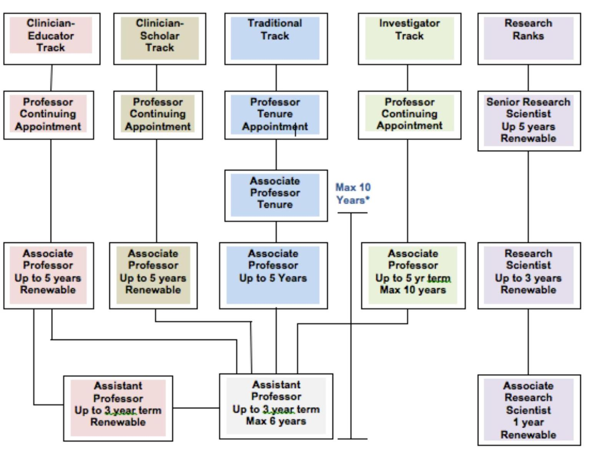
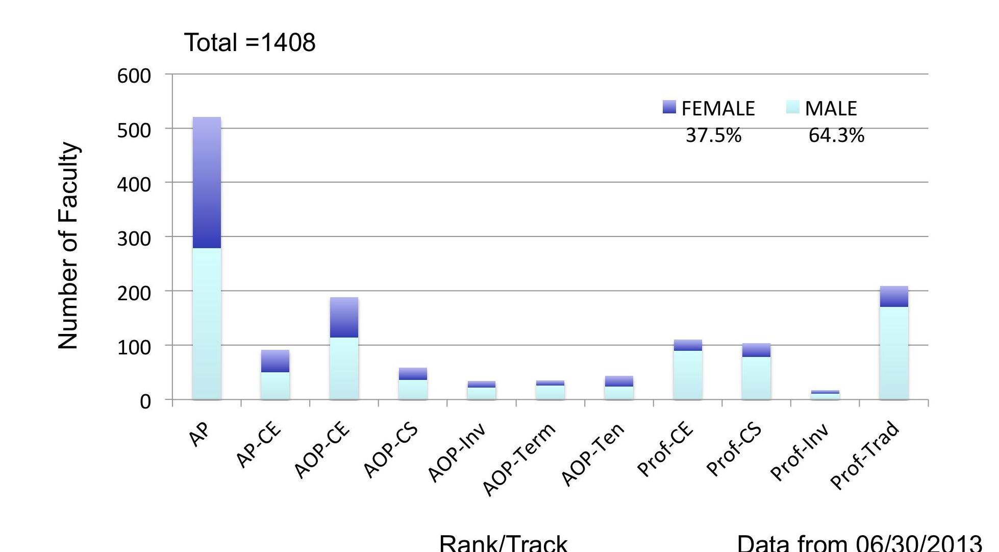
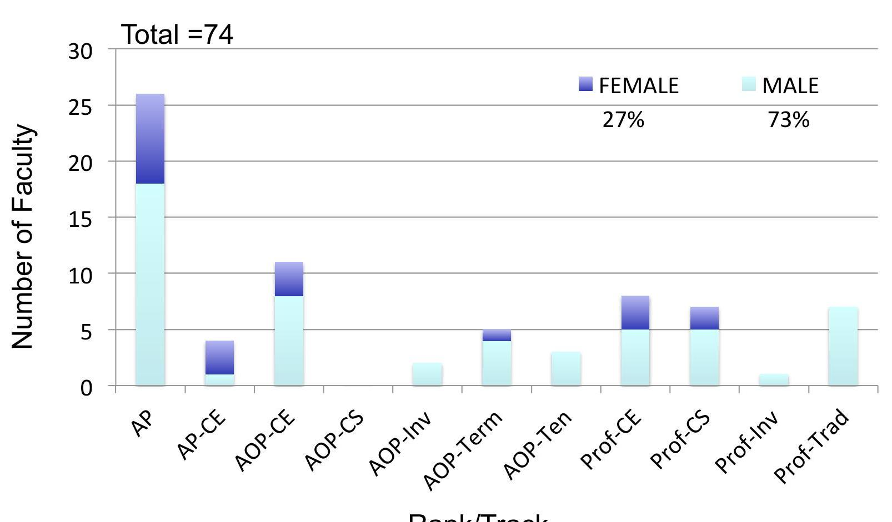
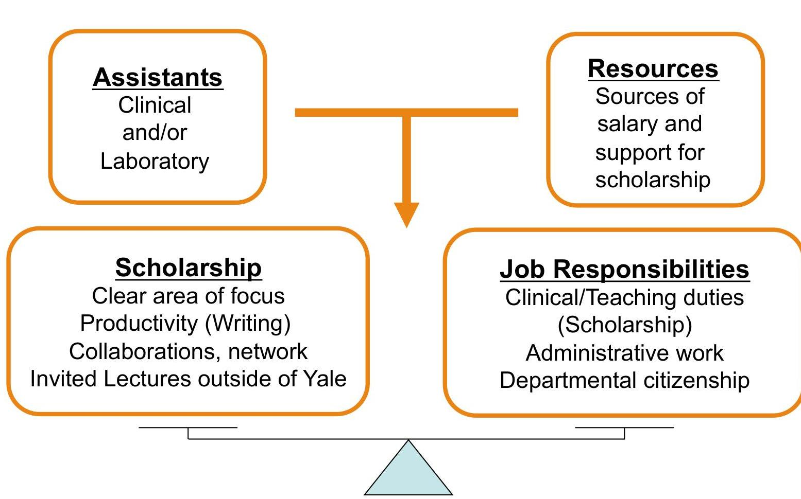
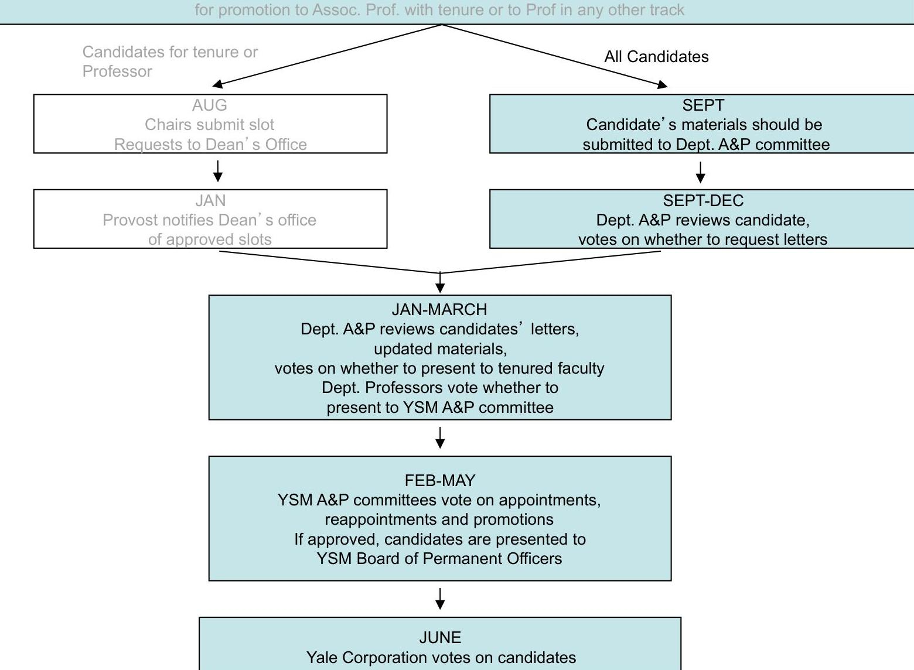
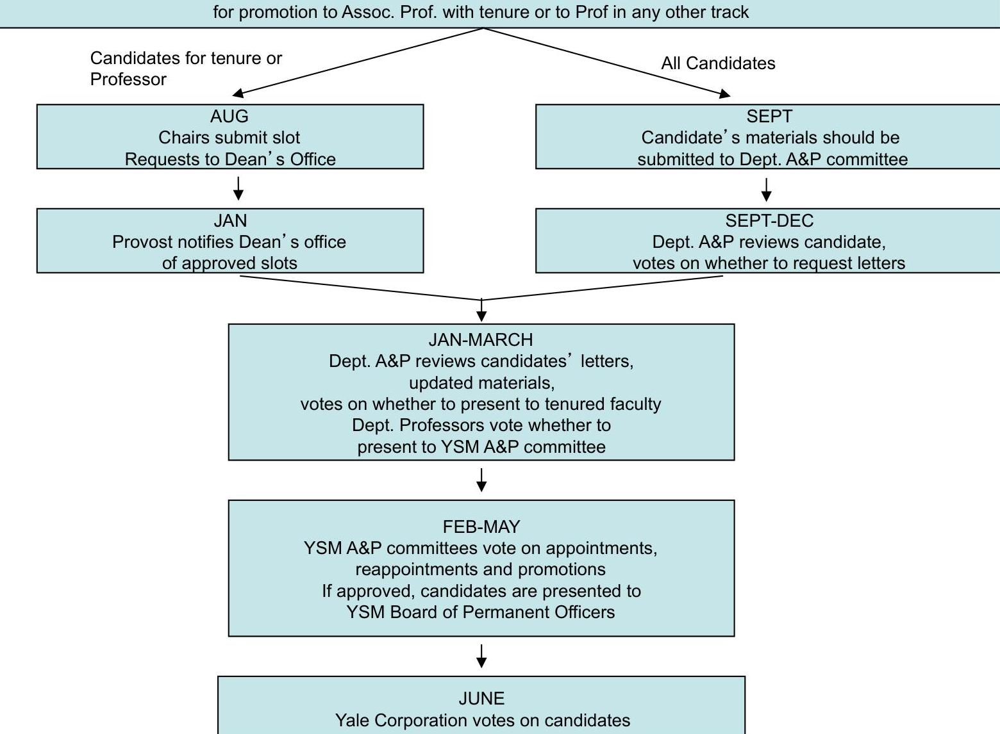

# YSM Faculty Advancement Series 

## Demystifying the Yale Promotion Process   Department of Diagnostic Radiology   October 22, 2013

## Linda Bockenstedt, MD

Harold W. Jockers Professor of Medicine
Director, Faculty Development \& Equity
Yale School of Medicine

---

# Faculty Tracks \& Positions 

- Ladder Ranks
- Assistant Professor
- Associate Professor
- Professor
- Ladder Tracks
- Traditional
- Clinician Scholar
- Clinician Educator
- Investigator
- Research Ranks
- Associate Research Scientist
- Research Scientist
- Senior Research Scientist
- Clinical Ranks
- Instructor
- Clinician
- Other

---

# Transitioning to the Ladder Faculty 

- Can move from the research ranks or instructor position to ladder faculty
- Cannot move back to ladder faculty if you left the Yale ladder faculty for a Yale research rank
- "Clock" starts at time of appointment as Assistant Professor
- Calendar year begins in June; the first YEAR end for an initial appt. that started May 2012 will end June 30, 2012.
- "Request for Position" (RFP) and a "National Search" are required to enter the ladder faculty
- except in case of K awardees, when search is deferred

---

# Assistant Professor Timeline 

- Maximum six years as an Assistant Professor
- Usually, 2 three-year terms
- Up to 3 years at another institution as Assistant Professor count toward six year limit
- Can apply for extension to term for child and care giving leaves
- Typically
- In first term, after 2 years, dept. reviews for reappointment
- In second term, after 2 years, dept. reviews for promotion

---

# Planning Your Career 

- Assistant Professors are "undifferentiated"
- Can declare Clinician-Educator track as Assistant Professor
- Aim toward one of Four Tracks
- Traditional (tenure - 10 yr rule)
- Investigator (2 five-year terms as Assoc Professor)
- Clinician-Scholar (no set \# of terms as Assoc Professor)
- Clinician-Educator (no set \# of terms as Assist or Assoc Professor)
- Only track in which one can be re-appointed as an Assistant Professor beyond six years

---

# YSM Faculty Tracks and Ranks 

---

# Distribution of YSM Ladder Faculty 

---

# Distribution of Ladder Faculty in the Department of Diagnostic Radiology 

Rank/Track
Data from 06/30/2013

---

# Getting Started - Clinician Educator 

---

# Your Leadership Style 

- Assess your leadership style before you hire employees
- How do you make decisions
- Do you want to manage details or just deal with the big picture
- How do you get along with colleagues?
- Do you work most effectively and comfortably with peers, supervisors or subordinates?
- Decide on the culture
- To effectively provide feedback to employees, they must first view you as their supervisor and not as their friend
- Set priorities

---

# The Mentor-Mentee Relationship 

- Responsibilities of the Mentor
- Know rules for promotion
- Help mentee create a 1, 3 and 5 year career plan
- Be available to meet at least twice a year to review progress
- Provide thoughtful, constructive feedback
- Assist mentee in networking
- Responsibilities of the Mentee
- Prepare for meetings with mentor
- Update CV
- Review goals
- Identify obstacles/barriers to progress
- Be receptive to constructive feedback

---

# Time Management Matrix 

## Urgent

I
Crises, personal or professional
Pressing personal or equipment problems
Deadline-driven projects

## Not urgent

II
Reading journals
Relationship building
Lab/Scholarship meetings
Thinking and planning
Recreation and relaxation

III
Interruptions, some calls
Some mail, some reports
Some meetings
Many administrative tasks

IV
Trivia, busywork
Some mail
Some phone calls
Most e-mail and web surfing

---

# Scholarship 

- Find your niche (specific focus)
- Work towards independence from previous mentors
- Find opportunities to become visible to the academic communities outside of Yale
- Submit abstracts to meetings
- Give lectures outside of Yale
- Become involved in committees of national organizations

---

# Yale University Faculty Handbook 

|  | Traditional Tenure | Clinician Scholar | Clinician Educator | Investigator |
| :--: | :--: | :--: | :--: | :--: |
| Eligibility | Excellence in research and teaching | Excellence as clinicians, public health practitioners, teachers and scholars | Excellence as clinicians or public health practitioners and teachers; must play an integral role in the dept. clinical and teaching programs and participate in research endeavors of the School | Demonstrate conceptual and creative leadership in research that may be carried out independently or as a key participant in a research team or core facility. If working collaboratively, the individual's creative contributions must be distinguished and identifiable. May engage in teaching but major responsibility is development of productive research programs |
| Associate Professor with term | Recognition as an independent investigator and demonstrated excellence as teacher; achievements as teachers and scholars should be strong enough that he/she would be eligible for tenure at Yale or another major medical institution in 4-5 years | Excel in patient care and teaching and must have an emerging national reputation for outstanding scholarship | Must have outstanding record of patient care or public health practice. Equally important, they must be exemplary teachers and active contributors to the educational mission of the School. Expected to influence the teaching or practice of medicine in a significant way and should participate in research and scholarly activities | Strong record of conceptual and creative research leadership in independent research or in collaborative efforts as part of a team. Creative contributions must be distinguished and identifiable. Clear evidence that academic growth will continue with expectation that individual will be suitable candidate for promotion to professor within 10 years. There must be a record of sustained funding sufficient to cover the salary and research activities. |

---

# Number of Referee Letters 

| Track | Rank | Solicits   Letters (\#) | Recommended by   Department | Recommended by   Candidate | Minimum   Required |
| :-- | :-- | :-- | :-- | :-- | :-- |
| Undifferentiated | Assistant Professor | Chair (3) |  | 3 | 3 |
| All Tracks (Trad.,   CS, CE, Invest.) | Associate Professor   (with term) | Chair (10) | 5 arms-length | 2 arms-length,   3 non-arms-length | 6, of which 4   are arms-length |
| All Tracks | Reappointment of   Assoc. Professors | Chair (6) | 3 arms-length | 3 arms-length or   non-arms-length | 4, of which 2   are arms-length |
| Traditional | Associate Professor   (without term) | Dean (12) | 6 arms-length | 4 arms-length,   2 non-arms-length | 8, of which 6   are arms-length |
| All Tracks | Professor | Dean (12) | 6 arms-length | 4 arms-length,   2 non-arms-length | 8, of which 6   are arms-length |
| Research Ranks | Research Scientist | Chair (6) | 3 arms-length | 3 non-arms-length |  |
|  | Senior Research   Scientist | Chair (6) | 3 arms-length | 3 arms-length |  |

---

# Re- Appointments and Promotions 

## All Re-appointments/Promotion

- Start in dept
> A\&P Coordinator for your department manages all materials
- Contingent upon
> accomplishments + plus projected contributions
> unique role yet "fit" with overall section/dept goals decide in conjunction with your mentor what your role will be
$>$ letters from referees
- Reviewed by Medical School A\&P Committees for Assoc Prof and Professor

---

# CV and CV Supplement 

- CV in Yale format documents career history and evidence of recognition outside of Yale
- The CV Supplement (Description of Activities) profiles your Yale activities and scholarly accomplishments
- time distribution, contributions to Yale and community, and scholarship
- Teaching evaluations are important
- All of your activities that are relevant to your track (see Faculty Handbook) are considered by the review committee

---

# CV Supplement: Description of Activities 

1. Percent Effort

Clinical care
$\qquad$
Educational activities
$\qquad$
Research/Scholarship
$\qquad$
Administration
Total
$100 \%$
2. Narrative Description (max 150 words)

Provide a $\leq 150$ word description of your role in the department and Yale School of Medicine

---

# CV Supplement: Description of Activities 

## 3. Educational Activities

A. Narrative Description (max 250 words)
B. Documentation of Teaching Activities

1) Table I (formal lectures, courses)
2) List other major lectures or educational activities conducted over prior term of appointment within the Medical Center

---

# CV Supplement: Description of Activities 

## 3. Educational Activities

## C. Mentoring Activities

1) Student mentoring: Thesis advisor for predoctoral and masters degree students (MD, PhD, or MPH students)
2) Postdoctoral mentoring: Postdoctoral fellows, clinical fellows and/or residents
3) Faculty mentoring
4) Other mentoring activities

---

# CV Supplement: Description of Activities 

## 3. Educational Activities

## D.Educational Leadership

1) Describe involvement in development or administration of courses, programs and other educational activities within the Medical Center
2) Describe involvement in educational activities regionally and nationally

---

# CV Supplement: Description of Activities 

## 4. Clinical Activities

A. Narrative Description (max 250 words)
B. Documentation of Clinical Activities

1) Table I (inpatient and ambulatory care responsibilities)
2) Percent of clinical time in recurring clinical care activities (total $=100 \%$ )
3) RVU or equivalent for your specialty
4) Quality of care measures

---

# CV Supplement: Description of Activities 

## C. Clinical Program Leadership

1) Describe involvement in development or administration of clinical programs within the Medical Center, along with key performance indicators
2) Describe involvement in development or administration of clinical programs outside the Medical Center, along with key performance indicators
3) Describe your involvement in quality of care initiatives (independent of A, B)
D. Describe your involvement in regional or national clinical guidelines committees

---

# CV Supplement: Description of Activities 

## 5. Research/Scholarship

A. Narrative Description (max 1 single-spaced page)

1) Describe your area of research or scholarship, its importance to basic or clinical science, and how it fits into the overall research mission of your department and/or the medical school.
2) Summarize your contributions and provide an estimate of its impact on progress in your major field of interest.
3) Describe your current studies and future directions.
B. Annotated Samples of Scholarship
C. Summarize your role in collaborative projects within the Medical Center and with other institutions.

---

# Overview of Promotion Process 

JULY
Dept. chair assembles list of candidates for reappointment or promotion
Candidates are informed of materials to assemble
Chair submits slot request to Dean's office
for promotion to Assoc. Prof. with tenure or to Prof in any other track

---

# Typical Profile of Associate ProfessorCE (YSM) 

- Distribution of Effort
- 50-90\% clinical/ education
- 5-25\% research
- 0-40\% service
- Outside lectures: many
- Original papers: several
- First/Last author: few
- Case reports: several
- Reviews: many
- Funding
- Limited NIH/other in $50 \%$
- Leadership (local)
- Director/Asst. Director
- National Service
- Committee work
- Guideline development
- Many candidates

---

# Typical Profile of Associate Professor-CS 

- Distribution of Effort
- 20-25\% clinical/ education
- 75-80\% research
- 0-5\% service
- Outside lectures: many
- Original papers:many
- First/Last author: >half
- Case reports: few, if any
- Reviews: several
- Funding
- NIH and other
- National Service
- Committee work
- Ad hoc grant reviews (NIH and other)
- Guideline development
- Sometimes

---

# Yale University Faculty Handbook 

## Traditional/Tenure Track Only

Associate Professor with tenure

## Traditional/Tenure

Must have produced a significant body of scholarship, must be able teachers, and if clinicians, must be accomplished in their clinical fields.
Must be rising toward national and international leadership in their areas of specialty. There must be clear evidence that academic growth will continue and value to institution and national/intl. standing will make them suitable for promotion to professor within a reasonable period of time.

## Traditional/Tenure

Professor*

## "Strength of commitment at this rank mandates that candidates have attained the same level of achievements in their domains as candidates for professor in all other ladder tracks

## Clinician Scholar

Must be national or international leaders in their field. In addition to excellence in patient care, public health practice, and teaching, they must have produced outstanding, nationally or internationally recognized scholarship that has substantially advance the field.

## Clinician Educator

Must be national or international leaders in their fields, as evidence by scholarship that has had a national impact on clinical medicine, public health or education, as well as sustained excellence in patient care and teaching.

## Investigator

Expected to stand in competition with the foremost leaders in their fields throughout the world. Must have a strong record of conceptual \& creative leadership that has significantly advanced the frontiers of knowledge as demonstrated by independent research or part of a team. If the latter, the contributions must be distinguishable and identifiable. Must have record of sustained funding to support salary and research activities

---

# Overview of Promotion Process 

JULY
Dept. chair assembles list of candidates for reappointment or promotion
Candidates are informed of materials to assemble
Chair submits slot request to Dean's office
for promotion to Assoc. Prof. with tenure or to Prof in any other track

---

# Promotion to Professor 

- Requesting "slot" approval by Provost
- Requires review of faculty positions within the department in relation to tracks, programmatic needs, junior/senior faculty
- Description of how requested position will fill programmatic needs
- Description of why candidate is suitable for the position (based on CV and Description of Activities)
- Suitable ranking of slot request and proposed candidate in comparison to other candidates for whom slot requests are made for the same track (interdepartmental ranking)
- Contingent also upon favorable referee letters and review by Department and by YSM Senior A\&P Committee

---

# Profile of Professors 

## CE TRACK

- Distribution of effort
- 50-75\% clinical/education
- 5-40\% scholarship
- 10-40\% service
- Leadership position locally, often nationally
- National presence in specialty societies
- Editorial Boards
- Best Docs/Major teaching awards local, nat' I
- Since appointment to Associate Professor
- Original papers: many
- Reviews/Chapters: many
- Invited speaking engagements

---

# Resources 

-- Faculty Handbook: website www.yale.edu/provost/html/facultyhb.html see section IV. 1 for School of Medicine
-- Office for Faculty Affairs website www.med.yale.edu/faculty/
--Questions: linda.bockenstedt@yale.edu